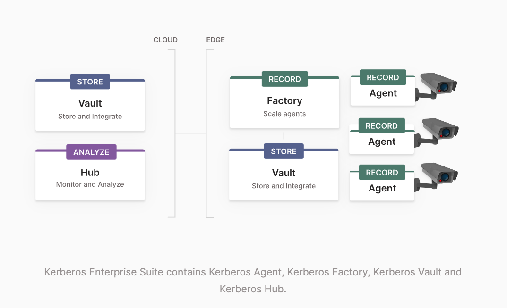

# Kerberos Factory

Kerberos Factory brings [the Kerberos Agent](https://github.com/kerberos-io/agent) to another level. [Kerberos Agent's](https://github.com/kerberos-io/agent) are deployed where and how you want, it can run as a binary, Docker container or inside a Kubernetes cluster. The latter is where Kerberos Factory comes into the picture. Kerberos Factory is a UI, build for non-technical users, that allows to deploy and configure [Kerberos Agents](https://github.com/kerberos-io/agent) into your Kubernetes cluster more easily. It bypasses the complexity of creating Kubernetes resources, by providing a simple UI to connect a Kerberos Agent to your camera, and configure it for your usecase.

Kerberos Factory is build for the management of [Kerberos Agents](https://github.com/kerberos-io/agent) in a Kubernetes cluster. If Kubernetes is out-of-scope for your deployment, and you plan to use a manual or single-node container deployment (e.g. Docker), it's recommended to use the default `docker compose` or `docker` CLI.

## :thinking: Prerequisites

* a Kubernetes cluster configured with one or more nodes.

## :books: Overview

### Installation
1. [Kubernetes](#kubernetes)

### Introductions
1. [Kerberos Factory](#kerberos-factory-1)
2. [Mission](#mission)
   
## Installation

As previously mentioned, running a Kerberos Factory, requires a Kubernetes cluster. If you plan to use solely `docker` or `docker compose` then Kerberos Factory is out-of-scope.

### Kubernetes

Leveraging Kerberos Factory allows you to deploy Kerberos Agents in you cluster. Kubernetes will automatically load balance your Kerberos Agents across your nodes, without you requiring all the hassle of scaling out your video landscape.

> Follow the `Kubernetes` tutorial [by navigating to the kubernetes sub folder in this repostitory](kubernetes/).

## Introductions

Please note that we have added a brief introduction to Kerberos Factory below. To get a complete overview [visit the documentation page](https://doc.kerberos.io), where you will be able to learn about all the ins and outs of the Kerberos.io ecosystem.

### Kerberos Factory

Kerberos Factory is a user interface which consumes and interacts with the Kubernetes API. It schedules [Kerberos Agents](https://github.com/kerberos-io/agent) as Kubernetes resource, and more specificly Kubernetes deployments. For every camera stream a Kerberos Agent is created as a Kubernetes deployment.

Through a web interface a non-technical administrator can configure and add more [Kerberos Agents](https://github.com/kerberos-io/agent) to its cluster. The administrator has the ability to interact with the Kerberos Agent through one or more configuration screens, to tune and optimize the Kerberos Agent for his/her specific usecase.

#### ONVIF

Kerberos Factory allows you to scan the local network and create Kerberos Agents for every discovered camera. Once discovered, Kerberos Factory will create a Kubernetes deployment for every Kerberos Agent.

#### Global settings

Instead of tuning all your Kerberos Agent, Kerberos Factory allows you to set up global settings which are inherited by all your Kerberos Agents. This feature helps scaling out and controlling your video landscape more easily.

### Mission

Kerberos Factory belong to the Enterprise suite. The goal of this suite is to support enterprises building a scalable video surveillance infrastructure that is open to support all business processes and usecases. Kerberos Enterprise Suite will do all the heavy lifting in terms scaling the processing and storage of you surveillance cameras. On top of that it will provide integration and extensibility to build your own applications on top of that using Swagger API's, and real-time messaging such as Kafka.

